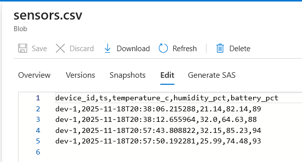
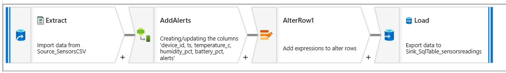
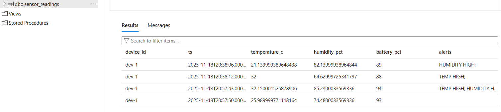

# DEPI Graduation Project: Real-time IoT Data Pipeline

## Project Planning

### 1. Project Overview
This project involves building a comprehensive, end-to-end data pipeline that simulates real-time IoT sensor data (temperature, humidity, and battery). The pipeline processes this data using both **batch (ETL)** and **real-time streaming** techniques, demonstrating cloud-native orchestration, real-time analytics, and live visualization.

### 2. Objectives
The primary goals achieved in this project are:
* **Simulate & Ingest:** Created a Python script to simulate IoT sensor data (`dev-1`) and ingest it simultaneously into a local message queue (Apache Kafka) and a cloud ingestion service (Azure Event Hubs).
* **Batch Process:** Built an automated batch ETL pipeline using **Azure Data Factory** (triggered by file uploads) to clean, transform, and load data into an **Azure SQL Database**.
* **Stream Process:** Implemented a streaming pipeline using **Azure Stream Analytics** to process data in real-time, utilizing Common Table Expressions (CTEs) to segregate alerts from raw logs.
* **Visualize:** Created a real-time dashboard using **Power BI** to visualize key metrics, system status, and historical trends.

### 3. Scope
* **In-Scope:** Data generation (Python), message queue (Kafka/Event Hubs), automated batch ETL (ADF), data warehousing (SQL), real-time stream processing (ASA), and data visualization (Power BI).
* **Out-of-Scope:** Physical IoT hardware management and advanced machine learning models.

### 4. Project Milestones
The project is divided into four key milestones:

* **Milestone 1: Data Simulation and Ingestion**
    * **Deliverable:** Python generator script with dual-ingestion capability (Kafka + Azure).
    * **Status:** ✅ **Completed**
    * **Details:** Implemented `generator.py` to simulate sensor readings and upload CSV dumps to Azure Blob Storage automatically upon termination.
    * **Source Code:** [generator.py](https://github.com/Mazen6999/Depi-Real-time-IoT-pipeline-/blob/main/milestone%202/milestone%201/generator.py)
    
    

* **Milestone 2: Batch Data Pipeline (ETL)**
    * **Deliverable:** Automated Azure Data Factory pipeline.
    * **Status:** ✅ **Completed**
    * **Details:** Created an ADF pipeline triggered by **Storage Events**. It performs an idempotent **UPSERT** into the SQL Warehouse to prevent duplicates.
    
    
    

* **Milestone 3: Streaming Pipeline with Alerts**
    * **Deliverable:** Azure Stream Analytics Job with multi-output logic.
    * **Status:** ✅ **Completed**
    * **Details:** Built a 1/3 SU Stream Analytics job reading from a 1-partition Event Hub. Used CTEs to split logic into three paths: Alerts (`dbo.alerts`), Live Logs (`dbo.live_readings`), and Dashboard Data (Power BI).
    <details>
    <summary>view Stream Analytics Query (SQL)</summary>

    ```sql
    WITH
    -- Step 1: Stage all data and cast values to proper types
    StagedData AS (
        SELECT
            device_id,
            TRY_CAST(TRY_CAST(ts AS nvarchar(max)) AS datetime) AS reading_time,
            TRY_CAST(temperature_c AS FLOAT) AS temperature_c,
            TRY_CAST(humidity_pct AS FLOAT) AS humidity_pct,
            TRY_CAST(battery_pct AS FLOAT) AS battery_pct
        FROM 
            "iot-stream"
    ),

    -- Step 2: Create a CTE for just the Temperature alerts
    TempAlerts AS (
        SELECT 'TEMP HIGH' AS alert_reason, device_id, reading_time, temperature_c AS reading_value
        FROM StagedData
        WHERE temperature_c > 30
        UNION
        SELECT 'TEMP LOW' AS alert_reason, device_id, reading_time, temperature_c AS reading_value
        FROM StagedData
        WHERE temperature_c < 21
    ),

    -- Step 3: Create a CTE for just the Battery alerts
    BatteryAlerts AS (
        SELECT 'LOW BATTERY' AS alert_reason, device_id, reading_time, battery_pct AS reading_value
        FROM StagedData
        WHERE battery_pct < 10 AND battery_pct > 0
        UNION
        SELECT 'NO POWER' AS alert_reason, device_id, reading_time, battery_pct AS reading_value
        FROM StagedData
        WHERE battery_pct = 0
    ),

    -- Step 4: Create a CTE for just the Humidity alerts
    HumidityAlerts AS (
        SELECT 'HUMIDITY HIGH' AS alert_reason, device_id, reading_time, humidity_pct AS reading_value
        FROM StagedData
        WHERE humidity_pct > 75
        UNION
        SELECT 'HUMIDITY LOW' AS alert_reason, device_id, reading_time, humidity_pct AS reading_value
        FROM StagedData
        WHERE humidity_pct < 35
    )

    -- ***************************************************************
    -- BLOCK 1: SEND ALL DATA TO POWER BI (NOW WITH 3 STATUS COLUMNS)
    -- ***************************************************************
    SELECT
        DATEADD(hour, -2, reading_time) AS ts_local,
        temperature_c,
        humidity_pct,
        battery_pct,
        device_id,
        
        -- Static Min/Max columns for gauges
        0 AS battery_min,
        100 AS battery_max,

        -- *** NEW: Binary Alert Column for Temperature ***
        CASE 
            WHEN temperature_c > 30 OR temperature_c < 21 THEN 1
            ELSE 0
        END AS IsTemperatureAlert,

        -- *** NEW: Binary Alert Column for Humidity ***
        CASE 
            WHEN humidity_pct > 75 OR humidity_pct < 35 THEN 1
            ELSE 0
        END AS IsHumidityAlert

    INTO
        [My-workspace] -- (Or whatever your Power BI alias is)
    FROM
        StagedData;


    -- ***************************************************************
    -- BLOCK 2: SEND ALL DATA TO YOUR NEW 'LiveReadingsOutput'
    -- ***************************************************************
    SELECT
        device_id,
        reading_time,
        temperature_c,
        humidity_pct,
        battery_pct
    INTO
        [live-readings] -- <-- MAKE SURE THIS MATCHES YOUR NEW ALIAS
    FROM
        StagedData;

    -- ***************************************************************
    -- BLOCK 3: SEND ALERTS TO YOUR SQL DATABASE (No Change)
    -- ***************************************************************
    SELECT *
    INTO [iot-warehouse]
    FROM TempAlerts
    UNION
    SELECT *
    FROM BatteryAlerts
    UNION
    SELECT *
    FROM HumidityAlerts;
    ```
    </details> 

    

    

* **Milestone 4: Dashboard & Final Report**
    * **Deliverable:** Real-time Power BI Dashboard.
    * **Status:** ✅ **Completed**
    * **Details:** Created a live dashboard with Status Cards (Text), Latest Alerts , Real-time Gauges (Numeric), and Historical Tables and Line Charts.

<p float="left">
  
  
  
</p>
<br>

### 5. Technologies
* **Data Generation:** Python (Libraries: `kafka-python`, `azure-eventhub`, `azure-storage-blob`)
* **Ingestion:** Apache Kafka (Local via Docker), Azure Event Hubs (Cloud)
* **Orchestration & Batch:** Azure Data Factory (Storage Event Triggers)
* **Streaming:** Azure Stream Analytics
* **Storage:** Azure Data Lake Gen2 (Blob), Azure SQL Database
* **Visualization:** Power BI Service (Real-time Dashboard) and Power BI Desktop

---

## Stakeholder Analysis

| Stakeholder Role | Interest in Project |
| :--- | :--- |
| **Operations Manager** | Uses the real-time Power BI dashboard to monitor "TEMP HIGH" or "HUMIDITY LOW" status cards. Relies on immediate visual feedback to prevent equipment failure. |
| **Data Analyst** | Uses the `dbo.live_readings` and `dbo.sensor_readings` SQL tables to analyze long-term trends and calculate sensor efficiency over weeks or months. |
| **DEPI Project Reviewers** | Evaluates the technical architecture, specifically the separation of "Speed Layer" (Stream Analytics) and "Batch Layer" (Data Factory) and the successful handling of event-driven automation. |

---

## Database Design

✅ **Status: Completed**

The project utilizes an **Azure SQL Database** with three specific tables designed for different latency requirements.

### 1. `dbo.sensor_readings` (Batch Warehouse)
* **Purpose:** Stores historical data processed in batches by ADF.
* **Key Feature:** Uses a composite Primary Key (`device_id` + `ts`) to ensure idempotency (no duplicates).
* **Schema:** `device_id` (PK), `ts` (PK), `temperature_c`, `humidity_pct`, `battery_pct`, `alerts`.

### 2. `dbo.live_readings` (Real-time Log)
* **Purpose:** Stores every single event received by Stream Analytics in real-time.
* **Key Feature:** High-volume write optimization.
* **Schema:** `device_id`, `reading_time`, `temperature_c`, `humidity_pct`, `battery_pct`.

### 3. `dbo.alerts` (Anomalies Only)
* **Purpose:** Stores *only* the events that breached a threshold (e.g., Temp > 30).
* **Key Feature:** Low-volume, high-value table for quick auditing.
* **Schema:** `alert_reason` (e.g., "TEMP HIGH"), `device_id`, `reading_time`, `reading_value`.

---

## UI/UX Design

✅ **Status: Completed**

The user interface is built on **Power BI Service** utilizing a **Real-time Dashboard** approach.

<video controls src="Dashboard Video.mp4" title="Title"></video>

### Dashboard Layout
* **Page 1:** provides an Overview of the sensor data, Battery - Time - Temp now - Humidity now and when was the last alert.<br>
     <br>  <br>
* **Page 2:** Full on page with historical data of the temperature in the last minute and a guage showing the average temperature<br>
     <br>  <br>
* **Page 3:** Full on page with historical data of the humidity in the last minute and a guage showing the average humidity <br>
     <br>  <br>


### Alert Logic (Visualized)
The dashboard reflects the following business logic processed in the cloud:
* **Temperature:** Alert if > 30°C or < 21°C.
* **Humidity:** Alert if > 75% or < 35%.
* **Battery:** Alert if < 10%. **in the cloud**