# Step 1: Set Up Your Azure Resources ☁️

First, you need to create the necessary building blocks in the Azure Portal. This first step is all about preparing your cloud environment.

* **Create a Resource Group**: This is a logical container to hold all your project's resources together. Name it something like `depi-iot-project-rg`.
* **Create a Storage Account**: This is where you'll upload your raw `sensors.csv` file. It will act as your "landing zone."
    * When creating it, choose **Azure Blob Storage**.
* **Create an Azure SQL Database**: This will be your data warehouse where the final, clean data will live.
    * You'll need to create a **SQL server** first as part of the process. Remember the admin username and password you set!
    * Make sure to configure its firewall to allow access from your computer and from other Azure services.
* **Create a Data Factory**: This is the orchestrator, the main ETL tool we will use to build the pipeline.

---

## Database Settings

* **Resource Group**: Select your existing group, `depi-iot-project-rg`.
* **Database name**: Give it a clear name, like `iot_warehouse` or `depi_project_db`.

### Server

You don't have a server yet, so you must click **Create new**.

* **Server name**: Must be globally unique and all lowercase. Use something like `depi-iot-sqlserver-` followed by your initials (e.g., `depi-iot-sqlserver-ab`).
* **Location**: Choose the same region as your storage account (e.g., West Europe).
* **Authentication method**: Select **Use SQL authentication**.
* **Server admin login**: Create a username, for example, `sqladmin`.
* **Password**: Create a strong password. ⚠️ **IMPORTANT**: Write this username and password down! You will need it to connect from Azure Data Factory.
* Click **OK**.
* **Want to use SQL elastic pool?**: No. This isn't needed for a single database project.
* **Compute + storage**: Click the **Configure database** link.
    * On the new page, select the **General Purpose** service tier.
    * For the Compute Tier, select **Serverless**.
    * Keep the default hardware and vCore settings.
    * You can set the **Auto-pause delay** to 1 hour to maximize cost savings.
    * Click **Apply**.

### Networking

After filling out the "Basics" tab, click **Next: Networking >**. On the Networking tab, you need to configure the firewall rules so you and other Azure services can access the database:

* **Connectivity method**: Select **Public endpoint**.
* **Allow Azure services and resources to access this server**: Set this to **Yes**. This is crucial for allowing Azure Data Factory to connect later.
* **Add current client IP address**: Set this to **Yes**. This allows you to connect from your computer to run queries.

After that, you can click **Review + create** and then **Create**.

---

## Create Azure Data Factory 🏭

1.  Go to the Azure Portal homepage.
2.  Click **Create a resource**.
3.  Search for **Data Factory** in the marketplace and select it.
4.  Click **Create**.

Now, fill out the "Basics" tab with the following settings:

* **Resource Group**: Select your existing group, `depi-iot-project-rg`.
* **Name**: This must be globally unique. Use something like `depi-iot-adf-` followed by your initials (e.g., `depi-iot-adf-ms`).
* **Region**: Crucially, select the **same region** you used for your other resources (e.g., West Europe).
* **Version**: Keep this as **V2**.
* **Git configuration**: You can skip this for now. Check the box that says **Configure Git later**.

After filling this out, click **Review + create** and then **Create**.

---

## Next Steps After Creating ADF

### Prepare the SQL Database

We need to create the `sensor_readings` table where the data will be loaded.

1.  Go to your Azure SQL Database in the portal.
2.  Click on the **Query editor** in the left-hand menu and log in using the SQL admin credentials you created.
3.  Paste and run the following script to create the table:
    ```sql
    CREATE TABLE dbo.sensor_readings (
        device_id NVARCHAR(50) NOT NULL,
        ts DATETIME2 NOT NULL,
        temperature_c FLOAT,
        humidity_pct FLOAT,
        battery_pct INT,
        alerts NVARCHAR(50)
    );
    ```
4.  Then run this script to add a primary key:
    ```sql
    ALTER TABLE [dbo].[sensor_readings]
    ADD CONSTRAINT PK_sensor_readings PRIMARY KEY (device_id, ts);
    ```

### Prepare the Blob Storage

We need to upload the source data file.

1.  Go to your Storage Account in the portal.
2.  Go to **Containers** and create a new container named `raw-data`.
3.  Inside the `raw-data` container, click **Upload** and select your `sensors.csv` file (the one without the Alerts column).

---

## Building the Pipeline in Azure Data Factory

It's time to build the actual pipeline. This is where we'll tell ADF how to connect your storage to your database and perform the transformation.

### Step 1: Launch the ADF Studio 🏭

First, we need to open the main user interface for Data Factory.

1.  In the Azure Portal, go to the **Data Factory** resource you created.
2.  On its overview page, click the **Launch Studio** button. This will open a new browser tab with the ADF workspace.

### Step 2: Create Linked Services (Connections) 🔗

Think of these as the saved connection strings that let ADF talk to your other services. We need to create two.

1.  In the ADF Studio, go to the **Manage** tab (the toolbox icon 🧰 on the left).
2.  Select **Linked Services** and click **+ New**.

#### Blob Storage Linked Service

* Search for and select **Azure Blob Storage**.
* **Name**: `AzureBlobStorage_Source`
* **Connect via integration runtime**: Leave as `AutoResolveIntegrationRuntime`.
* **Authentication method**: Account Key
* **Azure subscription**: Select your subscription from the dropdown.
* **Storage account name**: Select your storage account (e.g., `depiiotstorage...`) from the dropdown.
* Click **Test connection** to verify, then click **Create**.

#### SQL Database Linked Service

* Click **+ New** again.
* Search for and select **Azure SQL Database**.
* **Name**: `AzureSqlDatabase_Sink`
* **Azure subscription**: Select your subscription.
* **Server name**: Select your SQL server.
* **Database name**: Select your `iot_warehouse` database.
* **Authentication type**: SQL Authentication
* **User name**: Enter the admin login you created (e.g., `sqladmin`).
* **Password**: Enter the password you saved for your SQL server.
* Click **Test connection**, then **Create**.

### Step 3: Create the Pipeline and Data Flow ⚙️

Now we'll build the main workflow.

1.  Go to the **Author** tab (the pencil icon ✏️ on the left).
2.  Click the **+** sign and select **Pipeline**. A blank canvas will appear.
3.  In the **Activities** pane, open the **Move & transform** section.
    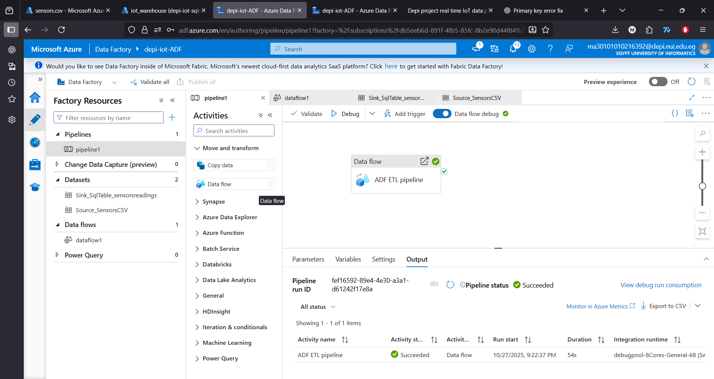
4.  Drag a **Data Flow** activity onto the pipeline canvas.

### Step 4: Configure the Data Flow (E-T-L)

This is the most important part. We'll define the source, the transformation, and the destination (sink). In the settings for the Data Flow activity, click **+ New**.

#### Add Source (The 'E' in ETL)

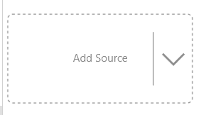
1.  On the Data Flow canvas, click **Add Source**.
    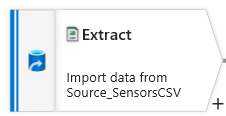
2.  Next to the **Dataset** field, click **+ New**.
3.  Select **Azure Blob Storage**, then **Continue**.
4.  Select **DelimitedText** (for CSV), then **Continue**.
5.  Set the following properties:
    * **Name**: `Source_SensorsCSV`
    * **Linked service**: Select the `AzureBlobStorage_Source` you just made.
    * **File path**: Click **Browse**, navigate into your `raw-data` container, and select your `sensors.csv` file.
    * Check the box for **First row as header**.
6.  Click **OK**. Your source is now configured.
    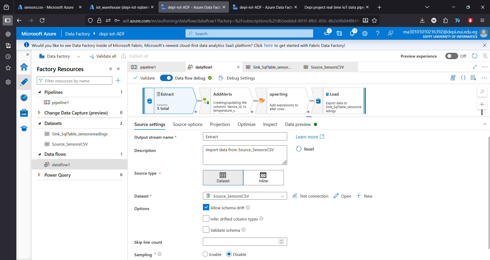

#### Correcting Data Types (Projection)

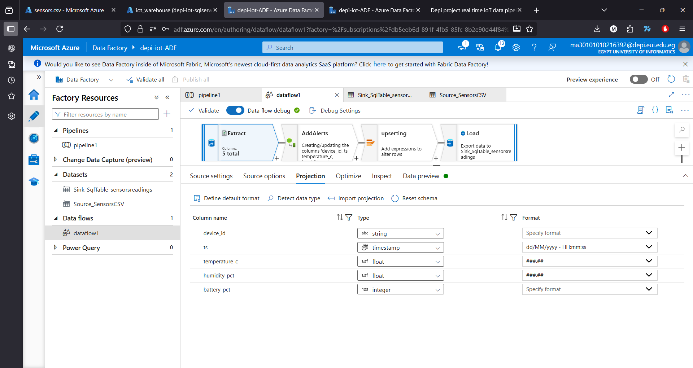
You need to tell ADF the exact format of your timestamp.
1.  In your Data Flow, go to the **Source** settings.
2.  Click on the **Projection** tab.
3.  You'll see a list of columns. Find the **ts** column.
4.  Change its **Type** from `string` to `timestamp`. Do this for other columns as needed.
5.  A new field called **Format** will appear. In that box, you must type the exact format of your date: `dd/MM/yyyy - HH:mm:ss`.
    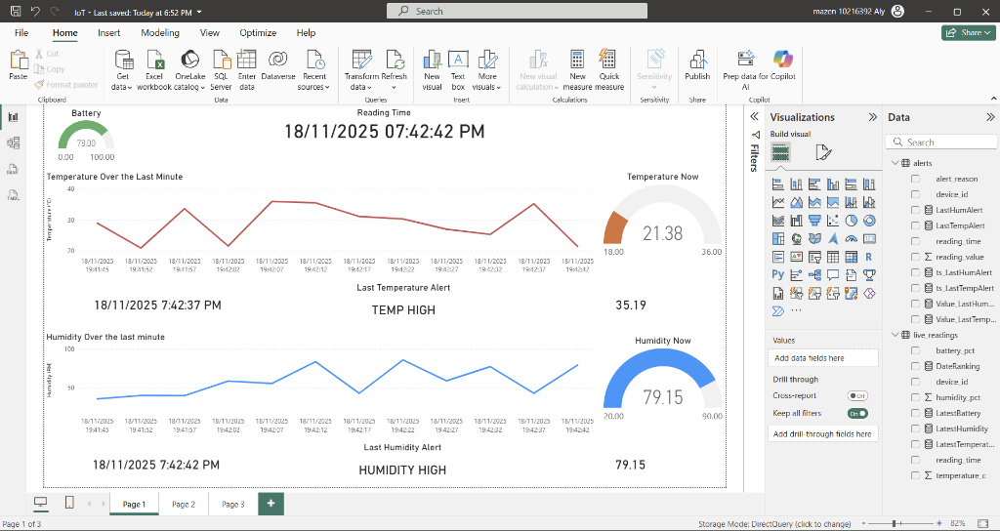

#### Add Transformation (The 'T' in ETL)

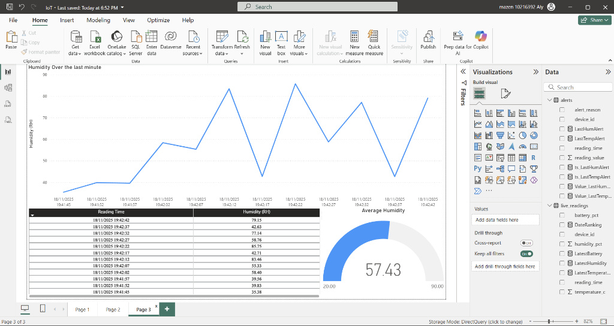
1.  Click the **+** icon next to your source on the canvas.
2.  Select **Derived Column** from the menu. This lets us create a new column.
    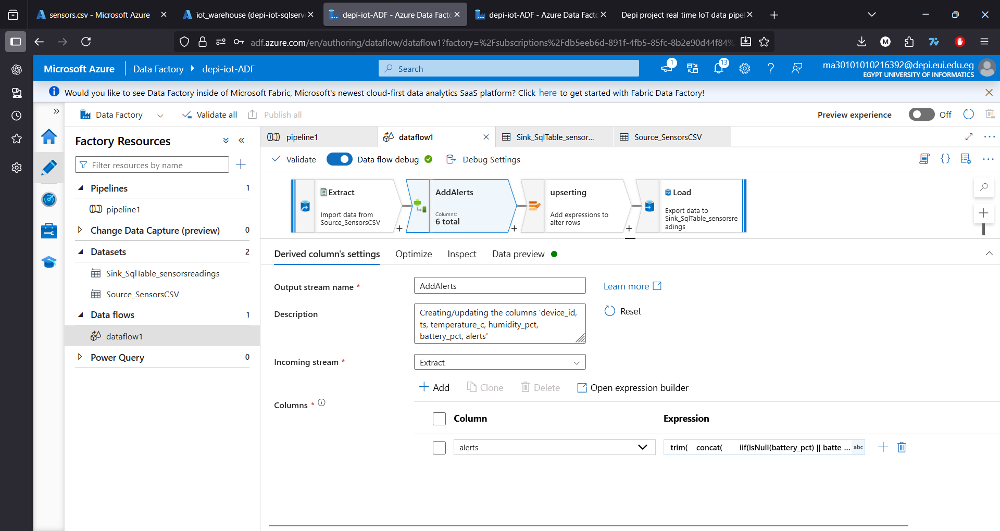
3.  **Column**: Name the new column `alerts`.
4.  **Expression**: Click on the "Enter expression" box. This opens the Expression Builder. Paste the following expression inside. This code recreates the logic you removed from your Python script.
    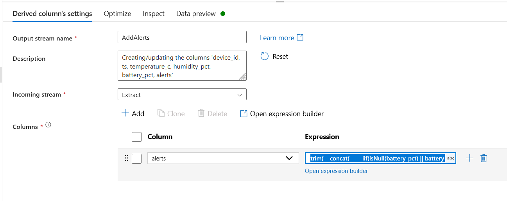
    ```
    trim(
        concat(
            iif(isNull(battery_pct) || battery_pct == 0, 'NO POWER; ', ''),
            iif(battery_pct < 10 && battery_pct > 0, 'LOW BATTERY; ', ''),
            iif(temperature_c > 30, 'TEMP HIGH; ', ''),
            iif(temperature_c < 21, 'TEMP LOW; ', ''),
            iif(humidity_pct > 75, 'HUMIDITY HIGH; ', ''),
            iif(humidity_pct < 35, 'HUMIDITY LOW; ', '')
        )
    )
    ```
5.  Click **Save and finish**.

#### Add Alter Row

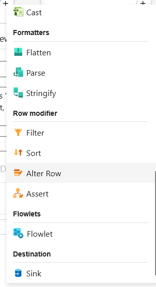
Our objective here is to prevent duplicate loading to the database.
1.  Add an **Alter Row** transformation after the Derived Column.
2.  Under **Alter row conditions**, add an upsert condition like `true()` to allow ADF to upsert all rows.
    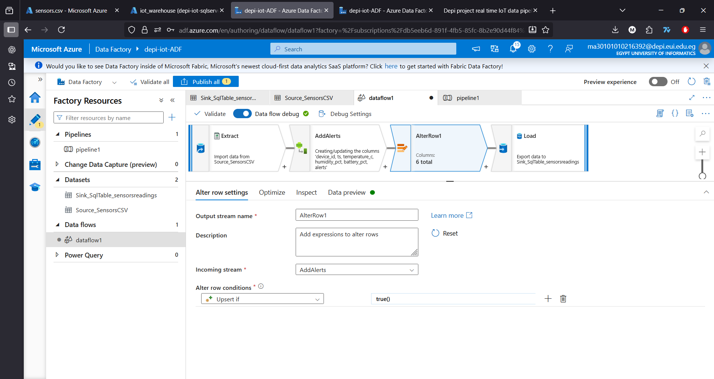

#### Add Sink (The 'L' in ETL)

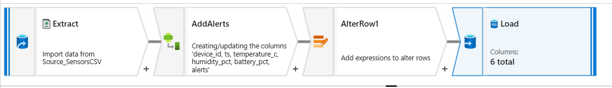
1.  Click the **+** icon next to your Alter Row transformation.
2.  Select **Sink**.
    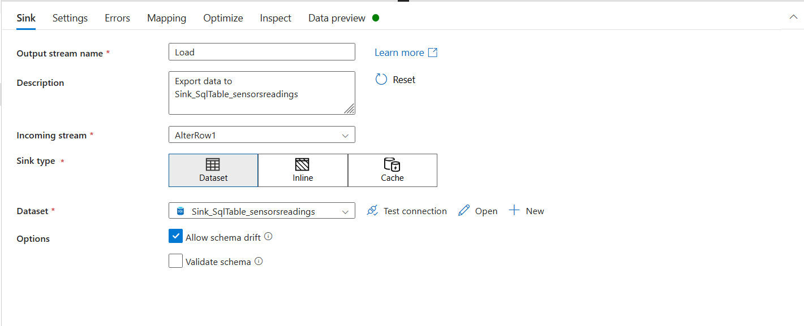
3.  Next to the **Dataset** field, click **+ New**.
4.  Select **Azure SQL Database**, then **Continue**.
5.  Set the following properties:
    * **Name**: `Sink_SensorReadingsTable`
    * **Linked service**: Select `AzureSqlDatabase_Sink`.
    * **Table name**: Select `dbo.sensor_readings` from the dropdown.
6.  Click **OK**.
7.  Go to the **Settings** tab of the sink.
8.  Enable the **Allow upsert** checkbox.
    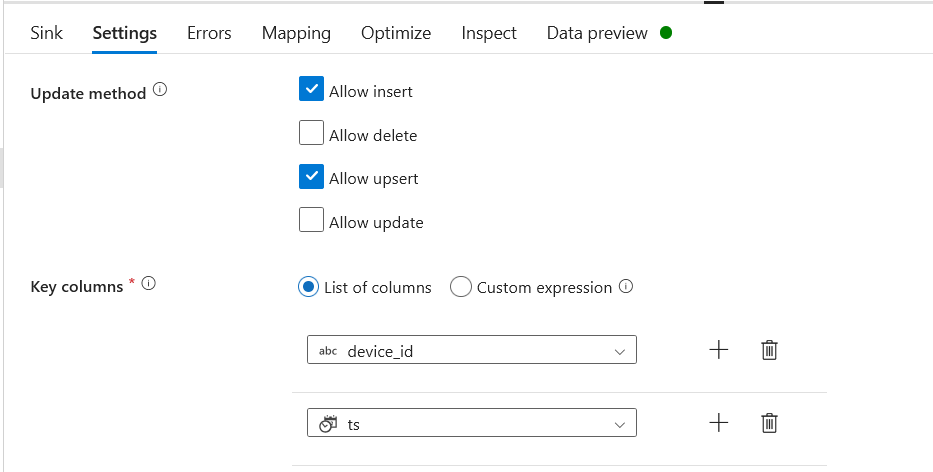
9.  For **Key columns**, add the `device_id` column and the `ts` column. This will ensure the upsert operation is based on this composite key.

---

## Step 5: Run and Verify ▶️

Your entire batch pipeline is now designed! Let's run it.

1.  Go back to your main pipeline tab (it's probably named `pipeline1`).
2.  At the top of the canvas, click **Debug**. This will start a test run of the pipeline.
3.  You can monitor the progress in the **Output** tab at the bottom. It should take a couple of minutes to start up and run.
4.  Once it succeeds (you'll see a green checkmark ✅), go to your Azure SQL Database in the Azure Portal, open the **Query editor**, and run this query:
    ```sql
    SELECT TOP (100) * FROM [dbo].[sensor_readings]
    ```

You should see your sensor data, now with the new `alerts` column correctly populated by your ADF pipeline!